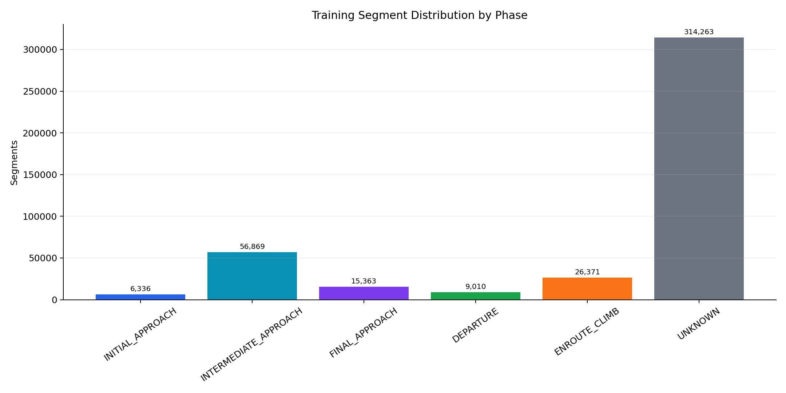
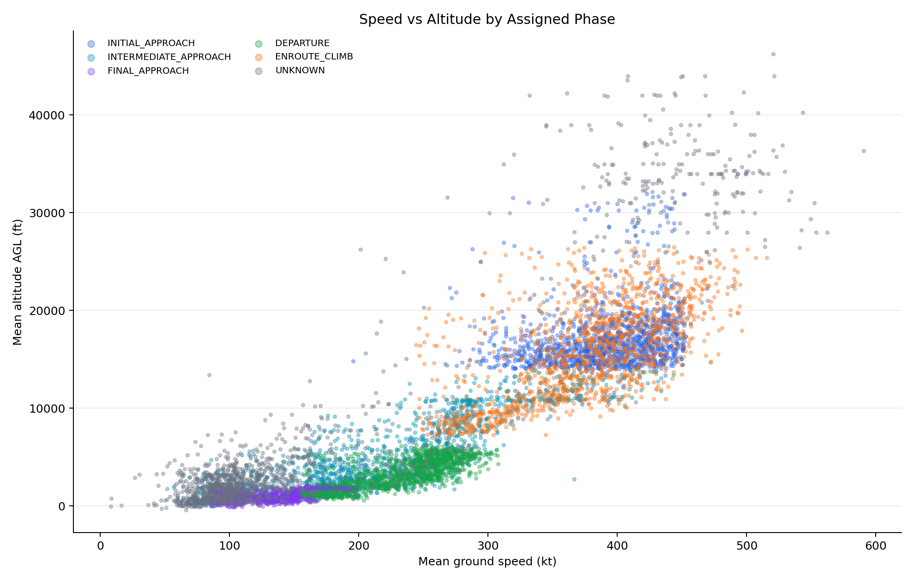
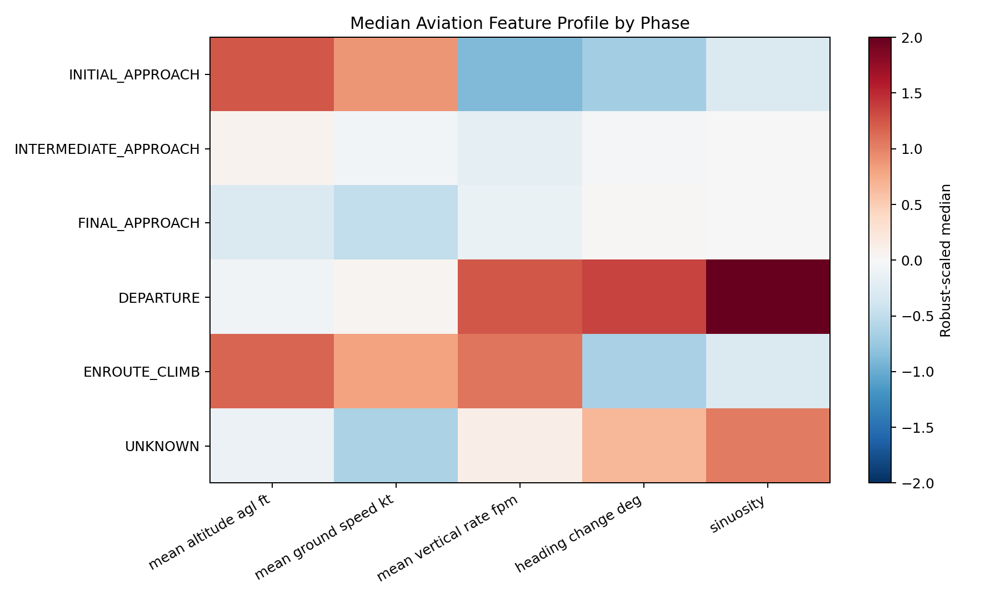
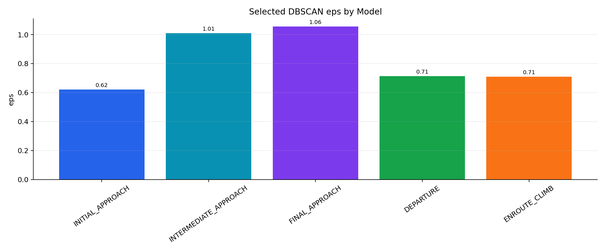
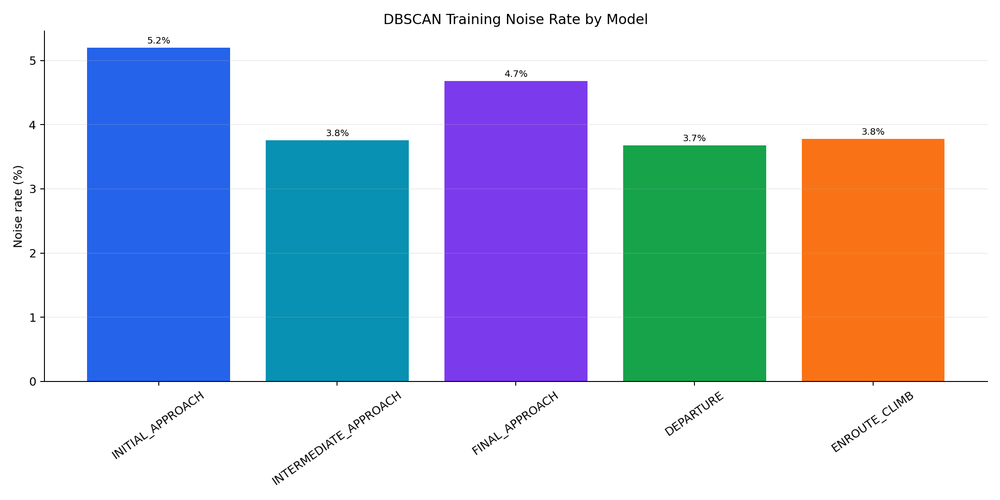
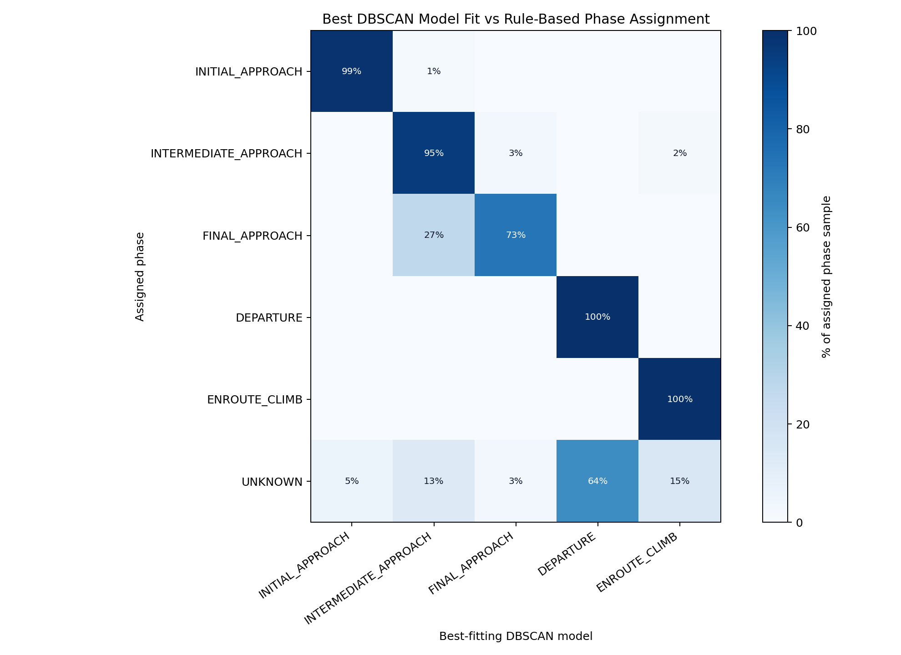
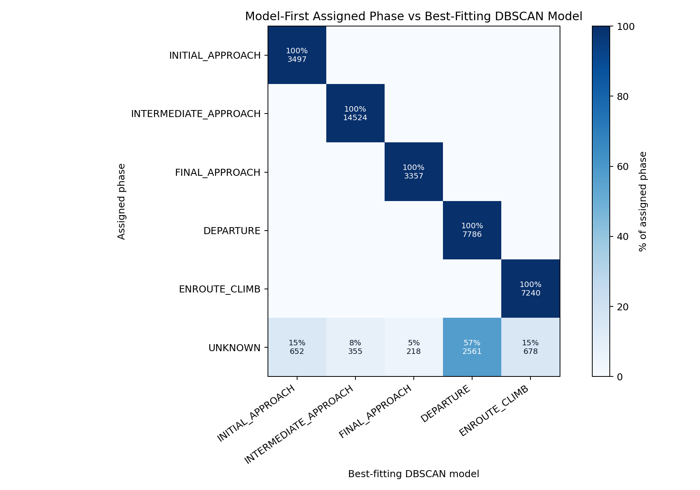
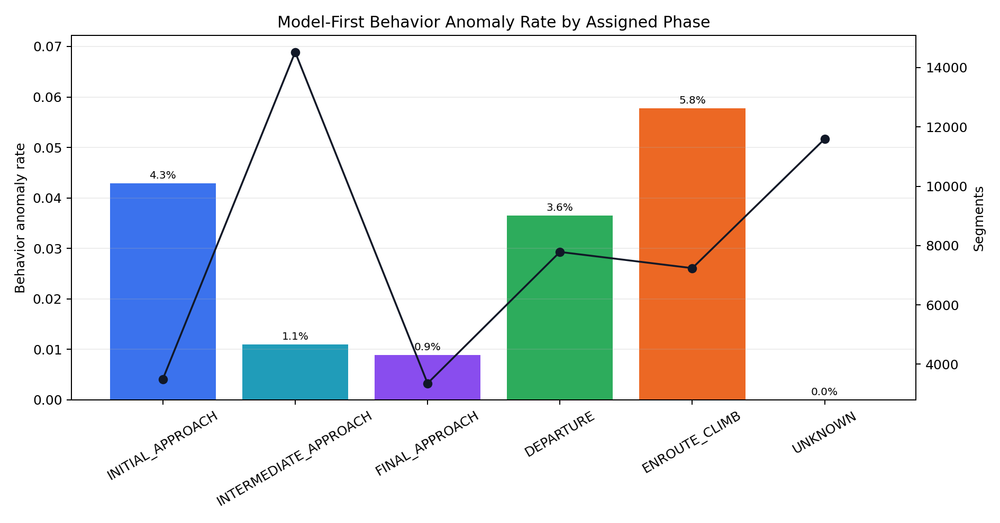
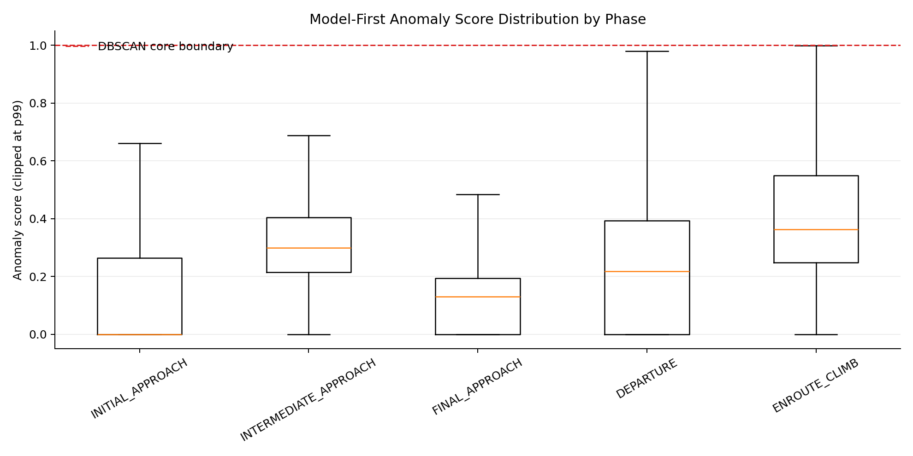
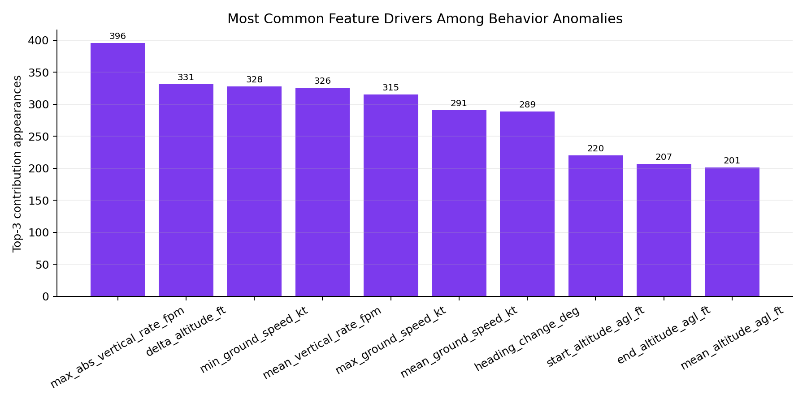

# Phase-Specific DBSCAN for ADS-B Flight Behavior Anomaly Detection

**Author:** [Your Name]  
**Course:** [Course Name]  
**Instructor:** [Instructor Name]  
**Date:** April 29, 2026

## Abstract

This project looks at a practical question: can ADS-B behavior near a major airport be modeled in a way that is useful without hand-labeled anomaly data? We focused on Hartsfield-Jackson Atlanta International Airport (ATL) and built a phase-aware unsupervised detector rather than one model for all traffic. The trained phases are `DEPARTURE`, `ENROUTE_CLIMB`, `INITIAL_APPROACH`, `INTERMEDIATE_APPROACH`, and `FINAL_APPROACH`. Segments outside those focused patterns are left as `UNKNOWN`.

The system was trained from 428,212 trajectory segments extracted from processed ADS-B data for December 20-30, 2025 within 120 nautical miles of ATL. The phase labels used for training are weak labels from aviation-context rules, not manually reviewed truth. At runtime, the rule label is not treated as final. Each phase-specific DBSCAN model scores the segment, and the segment is assigned to the best-fitting physically plausible phase only when the fit is strong enough.

The final implementation uses a custom DBSCAN variant rather than a direct call to vanilla DBSCAN. We added the parts needed for this use case: prediction from learned core samples, nearest-core anomaly scoring, feature-level contribution explanations, feature weighting, optional track-aware density constraints, and per-phase distance calibration. The calibration is especially useful because it turns a raw distance into a phase-relative percentile. Instead of only reporting a score such as 1.35, the dashboard can report that the segment is farther from normal than almost all training inliers for that same phase.

The current model agreement evaluation shows that the best-fitting DBSCAN model matches the weak training phase for 94.9% of sampled known-phase segments. A 48,000-row model-first live-style evaluation produced a 24.2% unknown rate and a 2.17% behavior anomaly rate. These results demonstrate feasibility and internal consistency, but they do not prove real-world anomaly accuracy because no expert-labeled anomaly set was available.

## 1. Introduction

ADS-B messages provide aircraft position, altitude, speed, heading, and vertical-rate information. The data is rich, but it is not immediately comparable across all aircraft. The same speed or altitude change can mean different things depending on where the aircraft is and what phase of flight it appears to be in. A low, slow aircraft aligned with a runway can be completely normal on final approach. A similar pattern far from a plausible airport would be harder to explain. Likewise, a strong climb rate is expected after departure but would be unusual near final approach.

That is why we did not use one global DBSCAN model. The central assumption is that "normal" should be defined within a flight phase. A departure segment should be compared to other departures, not to arrivals, cruise overflights, and low-level traffic at the same time. In this report, the word anomaly has a narrow meaning: a segment is anomalous when it does not fit the learned density structure for the phase model that best explains it.

The project has three practical goals:

1. Assign interpretable phases to live ADS-B segments.
2. Detect phase-specific behavioral anomalies without requiring hand-labeled anomaly examples.
3. Explain anomaly scores using the largest feature differences from the learned normal pattern.

## 2. Data

The primary data source is a set of processed ADS-B day files for December 20-30, 2025. After cleaning and segment building, the retained feature cache contains 428,212 trajectory segments within 120 nautical miles of ATL.

| Phase | Segments | Share |
|---|---:|---:|
| `UNKNOWN` | 314,263 | 73.39% |
| `INTERMEDIATE_APPROACH` | 56,869 | 13.28% |
| `ENROUTE_CLIMB` | 26,371 | 6.16% |
| `FINAL_APPROACH` | 15,363 | 3.59% |
| `DEPARTURE` | 9,010 | 2.10% |
| `INITIAL_APPROACH` | 6,336 | 1.48% |
| **Total** | **428,212** | **100.00%** |

At first glance, the `UNKNOWN` count looks high. In this design, that is acceptable. The goal is not to assign every aircraft in the region to an ATL phase. The goal is to model a focused set of ATL arrival, departure, and climb behaviors. If a segment is an overflight, a partial track, or traffic that appears more related to another airport, forcing it into one of the ATL models would make the output look cleaner but less honest.

Likely causes of `UNKNOWN` include:

- aircraft overflying the region without clear ATL arrival or departure intent,
- tracks that begin or end mid-flight and do not contain enough phase evidence,
- non-ATL operations near smaller airports inside the search radius,
- noisy or incomplete ADS-B fields such as missing vertical rate, speed, or heading,
- behavior that is valid aviation activity but outside the deliberately focused phase set.

This conservative behavior is intentional. Without flight plans, ATC clearances, or expert labels, the model should be allowed to say "unknown." That decision makes the dashboard less complete, but it reduces the risk of overconfident phase assignments.



## 3. Feature Engineering

The raw ADS-B points are too noisy and too local to score one by one, so the track builder converts messages into short trajectory segments. Each segment describes recent behavior rather than a single aircraft state. The main feature groups are:

| Feature group | Examples | Purpose |
|---|---|---|
| Kinematics | ground speed, vertical rate, heading change, speed change | Captures aircraft motion and maneuvering |
| Altitude profile | altitude AGL, altitude change, climb/descent trend | Separates climb, approach, and low-altitude behavior |
| Spatial context | airport distance, airport-relative movement, runway alignment proxies | Supports phase labeling, plausibility gates, and dashboard context |
| Track quality | segment duration, point count, recency | Avoids unstable classifications from weak tracks |

For DBSCAN scoring, we kept the feature matrix aviation-behavior focused. Airport-relative fields are still important, but they are used for context, phase labeling, and plausibility checks rather than as direct DBSCAN inputs. The DBSCAN distance is based on behavior features such as altitude AGL, speed, vertical rate, heading change, turn rate, sinuosity, and duration. Those features are scaled by phase-specific tolerances so altitude, speed, and heading behavior can be compared in a single distance calculation.





## 4. Phase Labeling Strategy

The project uses aviation-context weak labels to organize the training data. These labels come from altitude, speed, vertical rate, airport distance, movement toward or away from the airport, and runway-alignment evidence. They are useful labels, but they are not the same thing as manually verified truth.

The focused phase set is:

| Phase | Operational meaning |
|---|---|
| `DEPARTURE` | Low-altitude outbound traffic leaving ATL |
| `ENROUTE_CLIMB` | Continued climb after departure while still in the ATL operating region |
| `INITIAL_APPROACH` | Arrival traffic entering the ATL arrival environment |
| `INTERMEDIATE_APPROACH` | Arrival traffic closer to the terminal area and transitioning toward final alignment |
| `FINAL_APPROACH` | Low-altitude runway-aligned arrival traffic close to landing |
| `UNKNOWN` | Segment outside the focused ATL phase definitions or too ambiguous to assign |

The important design choice is the split between training and live scoring. Rules are used to create weak training partitions. In the live stream, however, the system lets all phase models score the segment and then chooses the best-fitting physically plausible model if the score and margin are acceptable. If no model fits well enough, the segment remains `UNKNOWN`.

This separates two decisions:

1. **Phase assignment:** choose the best-fitting valid phase model if the fit is strong enough.
2. **Anomaly detection:** after assigning a phase, compare the segment to that phase model's learned density structure.

A segment can therefore be assigned to the best phase model and still be flagged as unusual inside that phase.

## 5. Custom DBSCAN Model

DBSCAN fits the project because it does not need anomaly labels. It learns dense regions of behavior and treats points outside those regions as noise. That is a good match for ADS-B data: normal traffic is available in large volume, but reliable segment-level anomaly labels are not.

The implementation uses a custom DBSCAN class. The algorithm still follows the DBSCAN idea of density-reachable clusters, but the plain version of DBSCAN was not enough for the dashboard and scoring workflow. The custom version adds:

- prediction from learned core samples for new live segments,
- nearest-core distance used as an anomaly score,
- feature-level contribution explanations for the nearest core comparison,
- feature weighting,
- optional minimum unique-track support so a cluster cannot be created only by repeated segments from one aircraft,
- per-phase empirical distance calibration.

Each phase model is trained independently:

| Phase | Available segments | Training sample | Clusters | Noise rate | Selected eps | p95 distance | p99 distance |
|---|---:|---:|---:|---:|---:|---:|---:|
| `DEPARTURE` | 9,010 | 5,000 | 1 | 3.68% | 0.713 | 0.432 | 0.644 |
| `ENROUTE_CLIMB` | 26,371 | 5,000 | 1 | 3.78% | 0.709 | 0.473 | 0.654 |
| `FINAL_APPROACH` | 15,363 | 5,000 | 1 | 4.68% | 1.057 | 0.558 | 0.928 |
| `INITIAL_APPROACH` | 6,336 | 5,000 | 4 | 5.20% | 0.621 | 0.186 | 0.559 |
| `INTERMEDIATE_APPROACH` | 56,869 | 5,000 | 1 | 3.76% | 1.009 | 0.566 | 0.875 |





The raw anomaly score is simple:

```text
nearest_core_distance / selected_eps
```

A score below 1.0 means the segment is inside the learned DBSCAN core boundary for that phase. A score above 1.0 means it is outside the learned boundary and is treated as behaviorally anomalous.

The calibrated score adds context to that raw number. During training, the model stores the empirical nearest-core distance distribution for DBSCAN inliers in that phase. During scoring, the live segment's distance is converted into a phase-relative percentile. This lets the dashboard say that a segment is, for example, farther from normal than 97.5% or 99% of training inliers for the assigned phase. That is easier to interpret than a normalized distance by itself.

### 5.1 Parameter Selection

The model parameters were chosen with a practical goal in mind: keep the model stable and explainable without pretending there is a supervised accuracy target. Since there are no expert anomaly labels, tuning only for a performance number would be misleading.

| Parameter | Selection method |
|---|---|
| `eps` | Selected separately for each phase from the 90th percentile of k-nearest-neighbor distances, where `k` is the phase's `min_samples`; values are clamped by configured minimum and maximum bounds. |
| `min_samples` | Set by phase to require enough nearby behavior samples before a dense region is accepted. |
| `min_unique_tracks` | Chosen from aviation reasoning to reduce artificial density from overlapping segments of the same aircraft track. |
| Feature weights | Chosen by phase from aviation reasoning; climb/descent features receive higher weight where vertical motion is operationally important. |
| Raw anomaly cutoff | The DBSCAN core boundary is score `1.0`; scores above this are outside the learned core region. |
| Calibrated severity | Outlier severity is interpreted using each phase's empirical nearest-core distance distribution. |

The 5,000-row training cap per phase was a practical compromise. The custom DBSCAN implementation performs direct neighbor comparisons, so training time grows quickly as the sample size increases. Five thousand rows per phase kept training manageable while still giving each model a substantial sample. The downside is that larger phases, especially `INTERMEDIATE_APPROACH`, may lose some density detail from downsampling. We report both available and clean training segment counts so that this choice is visible.

## 6. Runtime Scoring and Dashboard

The live dashboard is the main way to inspect the model. It polls ADS-B data, builds recent track segments, scores each segment against every phase-specific DBSCAN model, and displays:

- assigned phase,
- behavior anomaly status,
- raw DBSCAN score,
- phase-relative distance percentile,
- confidence and nearest-cluster information,
- top alternate phase-model scores,
- nearest airports and adjustable airport marker radius,
- selected aircraft trail and replay controls.

The phase shown in the aircraft popup is the model-first assigned phase. The weak rule label is not the runtime authority. This matters because live traffic can include aircraft near ATL, near another airport, transiting the region, or only partially observed. In those cases, forcing a rule phase before scoring made the system harder to trust. Letting the models compete produced a cleaner runtime behavior.

The dashboard explanation combines three pieces of evidence:

1. Whether the segment is outside the assigned phase model's DBSCAN core.
2. How extreme the distance is relative to that phase's calibrated training distribution.
3. Which behavior features differ most from the nearest learned core pattern.

## 7. Evaluation

### 7.1 Phase Assignment Agreement

Because the project does not have hand-reviewed segment-level phase labels, the main phase sanity check compares the weak training phase with the phase of the best-fitting DBSCAN model. This is not a true accuracy test. It is a check on whether the weak training partitions make sense to the models trained from them.

In the current sampled evaluation, known-phase agreement is 94.9%. Including `UNKNOWN` rows, agreement is lower because `UNKNOWN` is intentionally not a trained operational phase.



| Assigned phase | Best model match |
|---|---:|
| `DEPARTURE` | 100.00% |
| `ENROUTE_CLIMB` | 100.00% |
| `INITIAL_APPROACH` | 98.60% |
| `INTERMEDIATE_APPROACH` | 95.35% |
| `FINAL_APPROACH` | 73.01% |

The weakest agreement is `FINAL_APPROACH`, where many sampled final segments fit the intermediate-approach model best. We do not view this as a failure of the whole approach. It is a useful diagnostic. Aircraft do not jump cleanly from intermediate approach to final approach; they transition continuously. This is also the phase where runway alignment and low-altitude assumptions matter most. Better distance-to-runway-threshold features, runway-specific alignment checks, and temporal smoothing across consecutive segments would likely reduce this ambiguity.

### 7.2 Model-First Live-Style Evaluation

A separate model-first evaluation sampled 48,000 segments and applied the same assignment logic used by the live scorer. This was meant to approximate how the system behaves in the dashboard, not to create a supervised benchmark. The loaded models were `DEPARTURE`, `ENROUTE_CLIMB`, `FINAL_APPROACH`, `INITIAL_APPROACH`, and `INTERMEDIATE_APPROACH`.

| Metric | Value |
|---|---:|
| Sample rows | 48,000 |
| Model-first unknown rate | 24.2% |
| Behavior anomaly rate | 2.17% |
| Combined anomaly rate | 2.19% |
| Assignment/best-model consistency | 89.1% |
| Median raw anomaly score | 0.269 |
| 95th percentile raw anomaly score | 0.840 |



The model-first unknown rate is expected because the system refuses assignment when no focused ATL phase model fits strongly enough. Unknowns include overflights, partial tracks, ambiguous airport intent, and aircraft that are outside the trained operational patterns. This makes the output less complete, but it is a better failure mode than assigning a confident-looking but poorly supported phase.





### 7.3 What the Evaluation Proves and Does Not Prove

The evaluation supports three limited claims:

1. The weakly labeled training partitions are mostly coherent for known phases.
2. The model-first scorer behaves conservatively by leaving many ambiguous rows as `UNKNOWN`.
3. The anomaly detector produces a low alert rate on ordinary traffic and provides interpretable feature-level reasons.

The evaluation does not prove true aircraft intent accuracy. The 94.9% agreement value measures consistency between weak phase labels and best-fitting DBSCAN models, not agreement with expert-labeled truth. The 2.17% behavior anomaly rate also does not prove that those rows are true operational anomalies. It only means those segments fell outside the learned phase-specific DBSCAN core. External validation with labeled events or expert review would be required to measure true anomaly precision and recall.

The model-first evaluation samples from the same overall processed period used to build the feature cache and train the models. It is therefore an internal consistency check, not a fully independent temporal holdout. The current report does not claim track-separated or day-separated external validation. A stronger experiment would train on December 20-27 and evaluate on December 28-30, with track IDs kept separated across training and evaluation.

### 7.4 Anomaly Interpretation

The anomaly model is not designed to produce many alerts under ordinary traffic. A low alert rate is expected when scoring regular ADS-B data, because the DBSCAN models were trained on normal operating patterns and the behavior anomaly threshold is tied to each phase model's learned core boundary. In other words, the goal is not to make the map look dramatic; it is to flag segments that are meaningfully outside the learned phase pattern.

The most useful anomaly output is not only the binary alert. It is the explanation. The current system reports:

- the assigned phase model,
- the raw nearest-core score,
- the calibrated phase-relative percentile,
- the largest feature-level differences from the nearest learned core sample.



This makes alerts easier to inspect than a generic "outside cluster" message. A final-approach alert can be described as outside the learned final-approach pattern, farther than a high percentage of final-approach training inliers, with the main differences coming from specific features such as speed, descent rate, heading change, or path curvature.

Example scored anomalies from the model-first sample are shown below. These are qualitative examples of model behavior, not confirmed safety events.

| Phase | Raw score | Percentile | Top feature differences | Interpretation |
|---|---:|---:|---|---|
| `ENROUTE_CLIMB` | 1.35 | p100.0 | altitude change high; end altitude high | Unusual for enroute climb; nearest-core distance exceeds the learned phase boundary. |
| `DEPARTURE` | 1.35 | p100.0 | maximum speed low; average speed low | Unusual for departure; nearest-core distance exceeds the learned phase boundary. |
| `INITIAL_APPROACH` | 1.35 | p100.0 | vertical rate high; altitude change high | Unusual for initial approach; nearest-core distance exceeds the learned phase boundary. |
| `INTERMEDIATE_APPROACH` | 1.35 | p100.0 | altitude change low; vertical rate low | Unusual for intermediate approach; nearest-core distance exceeds the learned phase boundary. |
| `DEPARTURE` | 1.34 | p100.0 | heading change high; turn rate high | Unusual for departure; nearest-core distance exceeds the learned phase boundary. |

## 8. Discussion

The biggest improvement over earlier versions was not adding more rules. It was removing unnecessary decision layers. Earlier versions mixed rule labels, learned thresholds, airport context, and DBSCAN scoring in ways that made live behavior hard to reason about. The final design is simpler:

1. Use aviation-context rules only to create weak training partitions.
2. Train one custom DBSCAN model per focused phase.
3. At runtime, let all phase models score the current segment.
4. Assign the best-fitting valid model when the score and margin are acceptable.
5. Flag behavior anomalies using the assigned model's DBSCAN core boundary.
6. Calibrate anomaly severity with the assigned phase's empirical nearest-core distance distribution.

This structure better matches the research problem. It does not require manual review, and it avoids pretending that weak rules are ground truth. The rules are aviation-context heuristics used for weak supervision. The evaluation is therefore about model consistency, anomaly response, and interpretability rather than supervised accuracy.

The train/test supervised phase-classification result is not the primary performance claim for this project. A random split against weak labels mostly measures agreement with heuristic labels, not true phase accuracy. It also penalizes reasonable model-first choices when weak labels are ambiguous. For that reason, this report uses training-phase versus best-model agreement and model-first live-style evaluation as the main phase performance evidence.

## 9. Limitations

The current system has several limitations:

- Phase labels are weak labels derived from aviation context, not manually reviewed truth.
- The focused phase set does not cover all possible traffic patterns near ATL.
- `UNKNOWN` is intentionally broad and includes overflights, partial tracks, ambiguous tracks, and non-ATL operations.
- Runway alignment and airport intent are inferred from ADS-B geometry rather than flight plans or ATC clearances.
- Per-phase calibration improves score interpretation, but it is still empirical and depends on the representativeness of the training days.
- The custom DBSCAN implementation uses direct neighbor comparisons, which is acceptable for this class-scale project but would need acceleration for much larger training sets.
- The current evaluation is not a temporal holdout and is not track-separated external validation.

These limitations define the correct interpretation. The model is a phase-aware unsupervised behavior detector, not a certified aircraft intent classifier.

## 10. Future Work

The most useful next improvements are:

1. Add multi-airport model context so nearby-airport traffic can be evaluated against the correct airport geometry.
2. Separate ATL-bound, ATL-departing, and overflight traffic using route or intent signals when available.
3. Add temporal smoothing so phase assignment cannot flicker between adjacent approach phases on consecutive polls.
4. Add a temporal holdout experiment, such as training on December 20-27 and evaluating on December 28-30.
5. Evaluate against reliable aviation event datasets if segment-level labels become available.
6. Add spatial indexing or approximate nearest-neighbor search to speed up custom DBSCAN training for larger datasets.

## 11. Conclusion

The final project is best described as a phase-aware, interpretable unsupervised ADS-B behavior detector for traffic near ATL. It uses aviation-context weak labels to train separate custom DBSCAN phase models, then uses model-first scoring for live assignment and anomaly detection. The sampled known-phase agreement of 94.9% between weak training phase and best-fitting model suggests that the focused training partitions are mostly coherent, with the main ambiguity occurring between final and intermediate approach.

The strongest contribution is interpretability. The system does not only say that a segment is outside a cluster. It identifies the assigned operational phase, reports raw DBSCAN distance, calibrates that distance against the phase's own training distribution, and lists the behavior features responsible for the difference. That makes the output more useful than comparing all aircraft against one global traffic model. External validation with expert-labeled anomalies or known aviation events is still needed before claiming true anomaly-detection accuracy.

## References

Ester, M., Kriegel, H.-P., Sander, J., and Xu, X. (1996). A density-based algorithm for discovering clusters in large spatial databases with noise. *Proceedings of the Second International Conference on Knowledge Discovery and Data Mining*.

Federal Aviation Administration. ADS-B and NextGen surveillance background. https://www.faa.gov/air_traffic/technology/adsb

OpenSky Network. ADS-B data and aircraft state vector documentation. https://opensky-network.org

OurAirports. Airport reference data. https://ourairports.com/data/

scikit-learn documentation. DBSCAN clustering. https://scikit-learn.org/stable/modules/generated/sklearn.cluster.DBSCAN.html
